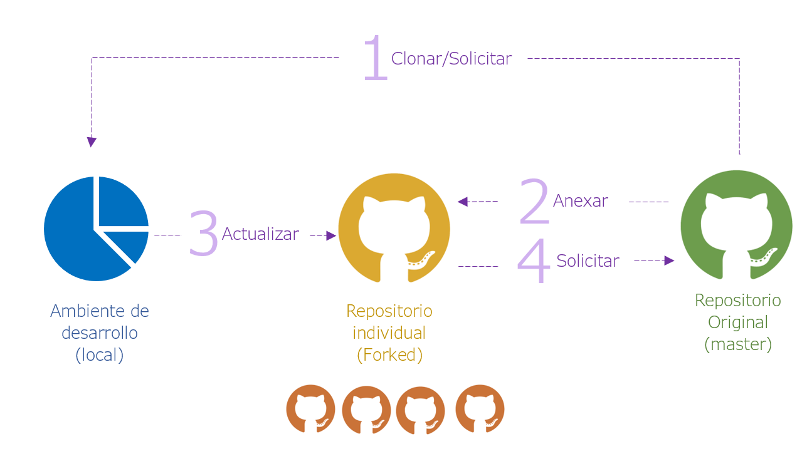

```{r packages, echo=FALSE, message=FALSE, warning=FALSE}
library(tidyverse)
```


### ¿De que se trata este curso?

Es una revisión de los principales elementos de la ciencia de datos, haciendo hincapié en el desarrollo de aplicaciones web.


## Principio de reproducibilidad


- ¿Las tablas y figuras son reproducibles a partir del código y los datos?


- ¿El código realmente hace lo que crees que hace?


- Además de lo que se hizo, ¿está claro **por qué** se hizo? (por ejemplo, ¿cómo se eligieron las configuraciones de los parámetros?)

### Aún más lejos


- ¿Es posible extender el código a otro conjunto de datos?

---

class: center

# Shiny Contest


.left[
### Un ejemplo de investigación reproducible:

- [RadaR](https://ceefluz.shinyapps.io/radar/)
- Radar en [Github](https://github.com/ceefluz/radar/blob/master/README.md)

]
---

## Fuentes de ayuda:

Las fuentes de ayuda más frecuentados para desarrollo de R son:

- [CRAN](https://cran.r-project.org/)
- [StackOverFlow](https://es.stackoverflow.com/) 
- [GitHub](https://github.com/)
- [RPubs](https://rpubs.com/)

---

# Introducción a GIT



[Libro Introducción a GIT](https://git-scm.com/book/es/v1/Empezando)

---
class: center, inverse, middle

#	Introducción a R y RStudio 

## (Semana 1):

---

### Instalación y conceptos básicos de R y RStudio

Se describe las particularidades de R y RStudio que agilitan el trabajo del usuario. Un análisis sobre el uso de RStudio ha revelado que los usuarios de R, especialmente en América Latina  desconoce de las funcionalidades de RStudio como IDE, en esta primera clase se exploran elementos como los AddIns, ShortCuts y otras herramientas de soporte para el analista.

###	Control de versiones con GIT

El registro de cambios en el tiempo es sin duda una de las piedras angulares para la optimización y mejora continua. GIT ofrece una integración completa con RStudio de tal manera que facilita el registro de la historia de una sintaxis o archivo. En esta ocasión se iniciara describiendo la dinámica de GIT para posteriormente unificarse con el workflow de R.

---

###	Operadores lógicos y Condicionales 

En primer lugar se describirán los objetos más básicos de la programación en R, estos son vectores y valores atómicos. En una segunda instancia se desarrolla una serie de operaciones básicas de transformación y extracción de elementos básicos de estructuras complejas como matrices y listas. Finalmente se describen los principales operadores como son los for loops, while, if, break y next,  mismos que permiten la elaboración de rutinas a través de los elementos de un objeto o empleando objetos. 

###	Funciones

La potencia de R viene de la mano de la programación funcional. Una función se puede interpretar como una serie de pasos que transforman un objeto en otro, durante este proceso entran en juego aspectos como el uso de la memoria interna del computador, ambientes y dependencias que pueden alterar el resultado deseado. Todos estos elementos serán discutidos en esta clase.

---

###	Manipulación de bases de datos

Sin hacer uso de ninguna librería R tiene por default una serie de herramientas que permiten realizar operaciones sobre elementos complejos tales como tablas y listas. En esta primera entrega sobre manipulación de bases de datos se emplearan funciones y herramientas de análisis que no salen del marco del lenguaje R básico.


---
class: center, inverse, middle

#	Un recorrido por el Tidyverse

## (Semana 2):


---

###	Importación de datos 

Empleando el paquete readr se hará un recorrido por las distintas formas de abrir archivos de distintos formatos, principalmente: textos delimitados, archivos de Excel, archivos SPSS, archivos dta y otros. Además se discute las maneras en que se introducen argumentos para obtener mejores resultados en la apertura de estos archivos.

---

###	Manipulación de bases de datos II

En esta ocasión se emplean los contenidos de la primera entrega del manejo de bases de datos, sin embargo esta vez se emplea los paquetes:

-	**dplyr:** gramática simplificada para manejo del contenido de bases de datos
-	**tibble:** tipo de datos más liviana y versátil para análisis de datos
-	**tydr:** manipulación de las dimensiones de una tabla
-	**stringr:** manejo de textos
-	**forcats:** manejo de factores

---

###	Interfaz gráfica con ggplot2

El paquete ggplot2 nace como una incorporación de “La grámatica gráfica”  de Leland Wilkinson en R, este paquete permite la generación de un sin número de gráficos con una lógica de capas.

###	Gráficos dinámicos con plotly

A diferencia del paquete ggplot2, el paquete plotly produce gráficos en HTML que permiten la interacción de los usuarios con los gráficos que se presentan en un navegador web, estos gráficos inicialmente se pueden crear y manipular en el entorno de RStudio, y principalmente se integran fácilmente con aplicaciones web desarrolladas en R.
	
### Mapas o coropléticos

Sean dinámicos o estáticos los gráficos de mapas requieren un entendimiento de un tipo particular de objetos, los shapefiles. En esta ocasión se integrará el conocimiento sobre gráficos en R y la manipulación de estos tipos de archivos.

---

### Exportación de datos y gráficos

Para el finalizar de esta semana el analista tendrá la capacidad de abrir y manipular cualquier tipo de archivo sin salir de la interfaz de RStudio. El paso final que debe dar es la exportación de sus resultados a un formato de conveniencia. En este sentido se revisaran las distintas opciones para cumplir con este objetivo y se hará un especial detenimiento en la generación de archivos Excel con formatos.

---
class: center, inverse, middle

#	Introducción a los reportes dinámicos con Markdown

## (Semana 3):


---


###	Creación de documentos dinámicos con Markdown

En función de todos los contenidos desarrollados en las dos semanas previas se procede a su incorporación en forma de reporte, en este caso se exploraran los distintos formatos a los que se puede apuntar con RMarkdown:
-	Archivos HTML (para despliegue en un navegador web)
-	Archivos PDF (requieren instalación de una distribución de LaTex)
-	Archivos Word
-	Ioslides/Xaringan, para la generación de presentaciones desde R

Además se discutirán los distintos métodos de publicación de estos reportes en la web, especialmente a los portales Rpubs y GitHub.

---

### Primeros conceptos de Shiny

Se discuten los conceptos esenciales de una aplicación web desarrollada en Shiny, siendo estos: 

-	Server.R
-	Global.R
-	Ui.R
-	Reactividad

###	Creación de dashboards simples

En el desarrollo de Markdown ya se distinguen elementos que conforman una aplicación web, se aplican los conceptos antes mencionados para desplegar una primera aplicación web cuya funcionalidad se pueda publicar en la página web shinyapps.io


---
class: center, inverse, middle

#	Aplicaciones web con Shiny

## (Semana 4):


---
# Shiny en profundidad

###	Funciones complejas de Shiny	

###	Inclusión de HTML/JavaScript

###	Introducción al perfilamiento y debugging

 
---
class: center, inverse, middle

#	Gracias