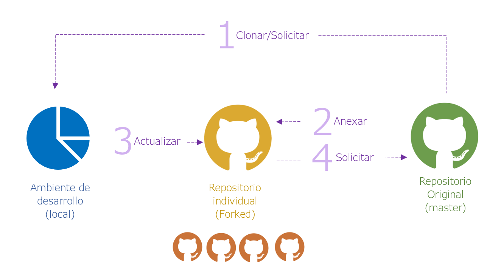

background-image: url(img_intro.png)
background-position: 50% 50%
class: center, top, inverse

# ¿Investigación reproducible?

---

# ¿Qué es R?

R es más que un lenguaje de programación, es un ambiente, en todo el sentido de la palabra. Este ambiente está respaldado por una comunidad que crece día a día. Sin embargo:

- La palabra ambiente implica colaboración.  
- Los proyectos (paquetes/librerias) deben ser seguidos en el tiempo en un ciclo de mejora continua.
- No siempre se contará con el mismo equipo.
- En producción no debe haber fallos (resposabilidad de equipo)

## Necesitas ayuda:
Las fuentes de ayuda más frecuentados para desarrollo de R son:

- [CRAN](https://cran.r-project.org/)
- [StackOverFlow](https://es.stackoverflow.com/) 
- [GitHub](https://github.com/)
- [RPubs](https://rpubs.com/)

---

class: inverse, top, middle

# Conoce tu IDE

background-image: url(rstudio_logo.png)

---

# Aliados

.pull-left[

]

.pull-right[
- **Git**: Mini Sistema de archivos que colecciona el historial de un proyecto. 

**"Buid Software better, togheter"**
 - **GitHub:** Aloja proyectos empleando el sistema de control de versiones **GIT**
]

---

# Clone, pull, push

---

